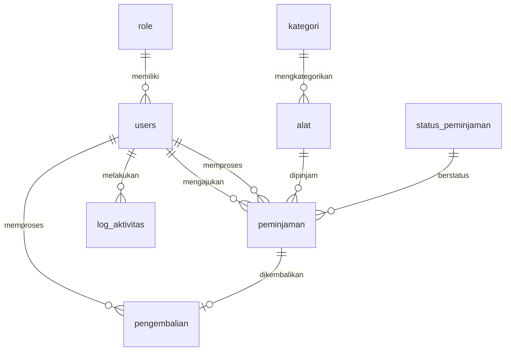

# Sistem Peminjaman Alat

Aplikasi manajemen peminjaman alat berbasis **Flutter** dengan backend **Supabase**. Aplikasi ini mendukung multi-role (Admin, Petugas, Peminjam) untuk mengelola peminjaman dan pengembalian alat.

---

## 📋 Fitur Utama

- **Multi-Role System**: Admin, Petugas, dan Peminjam dengan akses berbeda.
- **Manajemen Alat**: CRUD alat dengan kategori, kondisi, dan foto.
- **Transaksi Peminjaman**: Pengajuan, persetujuan, dan tracking peminjaman.
- **Pengembalian**: Pencatatan pengembalian dengan kalkulasi keterlambatan dan pembayaran.
- **Dashboard**: Statistik dan laporan aktivitas.
- **Log Aktivitas**: Pencatatan semua aktivitas user.

---

## 🛠️ Teknologi yang Digunakan

| Teknologi | Versi |
|-----------|-------|
| Flutter SDK | ^3.10.0 |
| Dart | ^3.10.0 |
| Supabase Flutter | ^2.12.0 |
| Riverpod | ^3.1.0 |

---

## ⚙️ Cara Instalasi

### Prasyarat

Pastikan Anda telah menginstall:
- [Flutter SDK](https://flutter.dev/docs/get-started/install) (versi 3.10.0 atau lebih baru)
- [Git](https://git-scm.com/downloads)
- IDE: [VS Code](https://code.visualstudio.com/) atau [Android Studio](https://developer.android.com/studio)

### Langkah Instalasi

1. **Clone Repository**
   ```bash
   git clone https://github.com/darennnr/paket_3_training.git
   cd paket_3_training/App
   ```

2. **Install Dependencies**
   ```bash
   flutter pub get
   ```

3. **Konfigurasi Environment**
   
   Buat file `.env` di root folder `App/` dengan isi:
   ```env
   SUPABASE_URL=your_supabase_url
   SUPABASE_ANON_KEY=your_supabase_anon_key
   ```

4. **Setup Database Supabase**
   
   - Buat project baru di [Supabase](https://supabase.com/)
   - Jalankan SQL schema yang tersedia di bagian [Database Structure](#-database-structure)
   - Copy URL dan Anon Key ke file `.env`

5. **Jalankan Aplikasi**
   ```bash
   # Untuk web
   flutter run -d chrome
   
   # Untuk Android
   flutter run -d android
   
   # Untuk Windows
   flutter run -d windows
   ```

---

## 🗄️ Database Structure

Aplikasi ini menggunakan **Supabase (PostgreSQL)** sebagai database. Berikut adalah struktur tabel yang digunakan:

### Entity Relationship Diagram



### Tabel: `role`

| Kolom | Tipe | Keterangan |
|-------|------|------------|
| `id` | INTEGER | Primary Key, Auto Increment |
| `role` | VARCHAR | Nama role (admin, petugas, peminjam) |

---

### Tabel: `users`

| Kolom | Tipe | Keterangan |
|-------|------|------------|
| `user_id` | INTEGER | Primary Key, Auto Increment |
| `username` | VARCHAR | Username unik |
| `password` | VARCHAR | Password terenkripsi |
| `nama_lengkap` | VARCHAR | Nama lengkap user |
| `email` | VARCHAR | Email unik |
| `no_telepon` | VARCHAR | Nomor telepon |
| `role_id` | INTEGER | Foreign Key ke `role` |
| `created_at` | TIMESTAMP | Waktu pembuatan |
| `updated_at` | TIMESTAMP | Waktu update terakhir |

---

### Tabel: `kategori`

| Kolom | Tipe | Keterangan |
|-------|------|------------|
| `kategori_id` | INTEGER | Primary Key, Auto Increment |
| `nama_kategori` | VARCHAR | Nama kategori alat |
| `deskripsi` | TEXT | Deskripsi kategori |
| `created_at` | TIMESTAMP | Waktu pembuatan |
| `updated_at` | TIMESTAMP | Waktu update terakhir |

---

### Tabel: `alat`

| Kolom | Tipe | Keterangan |
|-------|------|------------|
| `alat_id` | INTEGER | Primary Key, Auto Increment |
| `kategori_id` | INTEGER | Foreign Key ke `kategori` |
| `kode_alat` | VARCHAR | Kode alat unik |
| `nama_alat` | VARCHAR | Nama alat |
| `kondisi` | VARCHAR | Kondisi alat (default: 'baik') |
| `jumlah_total` | INTEGER | Total jumlah alat |
| `jumlah_tersedia` | INTEGER | Jumlah alat yang tersedia |
| `harga_perhari` | NUMERIC | Harga sewa per hari |
| `foto_alat` | VARCHAR | URL foto alat |
| `created_at` | TIMESTAMP | Waktu pembuatan |
| `updated_at` | TIMESTAMP | Waktu update terakhir |

---

### Tabel: `status_peminjaman`

| Kolom | Tipe | Keterangan |
|-------|------|------------|
| `id` | INTEGER | Primary Key, Auto Increment |
| `status_peminjaman` | VARCHAR | Status (pending, accepted, rejected, returned) |

---

### Tabel: `peminjaman`

| Kolom | Tipe | Keterangan |
|-------|------|------------|
| `peminjaman_id` | INTEGER | Primary Key, Auto Increment |
| `peminjam_id` | INTEGER | Foreign Key ke `users` (peminjam) |
| `alat_id` | INTEGER | Foreign Key ke `alat` |
| `petugas_id` | INTEGER | Foreign Key ke `users` (petugas) |
| `kode_peminjaman` | VARCHAR | Kode peminjaman unik |
| `jumlah_pinjam` | INTEGER | Jumlah alat yang dipinjam |
| `tanggal_pengajuan` | TIMESTAMP | Tanggal pengajuan |
| `tanggal_pinjam` | DATE | Tanggal mulai pinjam |
| `tanggal_berakhir` | DATE | Tanggal batas pengembalian |
| `keperluan` | TEXT | Keperluan peminjaman |
| `status_peminjaman_id` | INTEGER | Foreign Key ke `status_peminjaman` |
| `catatan_petugas` | TEXT | Catatan dari petugas |
| `created_at` | TIMESTAMP | Waktu pembuatan |
| `updated_at` | TIMESTAMP | Waktu update terakhir |

---

### Tabel: `pengembalian`

| Kolom | Tipe | Keterangan |
|-------|------|------------|
| `pengembalian_id` | INTEGER | Primary Key, Auto Increment |
| `peminjaman_id` | INTEGER | Foreign Key ke `peminjaman` |
| `petugas_id` | INTEGER | Foreign Key ke `users` (petugas) |
| `tanggal_kembali` | TIMESTAMP | Tanggal pengembalian |
| `kondisi_alat` | VARCHAR | Kondisi alat saat dikembalikan |
| `jumlah_kembali` | INTEGER | Jumlah alat yang dikembalikan |
| `keterlambatan_hari` | INTEGER | Jumlah hari keterlambatan |
| `catatan` | TEXT | Catatan pengembalian |
| `total_pembayaran` | BIGINT | Total pembayaran |
| `status_pembayaran` | TEXT | Status pembayaran |
| `created_at` | TIMESTAMP | Waktu pembuatan |

---

### Tabel: `log_aktivitas`

| Kolom | Tipe | Keterangan |
|-------|------|------------|
| `log_id` | INTEGER | Primary Key, Auto Increment |
| `user_id` | INTEGER | Foreign Key ke `users` |
| `aktivitas` | VARCHAR | Jenis aktivitas |
| `tabel_terkait` | VARCHAR | Nama tabel yang terpengaruh |
| `id_terkait` | INTEGER | ID record yang terpengaruh |
| `deskripsi` | TEXT | Deskripsi aktivitas |
| `user_agent` | TEXT | User agent browser/device |
| `created_at` | TIMESTAMP | Waktu aktivitas |

---

## 📁 Struktur Folder

```
lib/
├── config/          # Konfigurasi app
├── core/            # Routes dan tema
├── models/          # Data models
├── providers/       # State management (Riverpod)
├── screens/         # UI screens
│   ├── admin/       # Halaman admin
│   ├── auth/        # Halaman login
│   ├── peminjam/    # Halaman peminjam
│   └── petugas/     # Halaman petugas
├── services/        # API services
├── widgets/         # Reusable widgets
└── main.dart        # Entry point
```

---

## 📄 License

Project ini dibuat untuk keperluan pembelajaran dan pelatihan.

---

## 👤 Author

**Darren** - [GitHub](https://github.com/darennnr)
